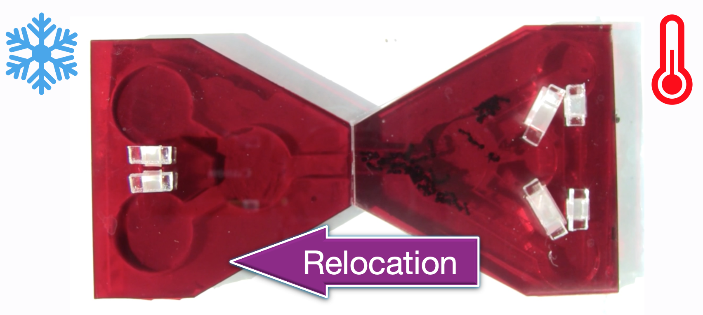
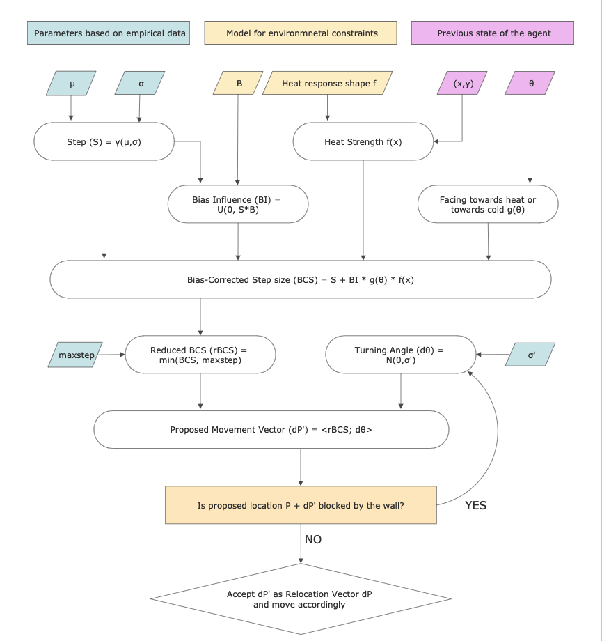
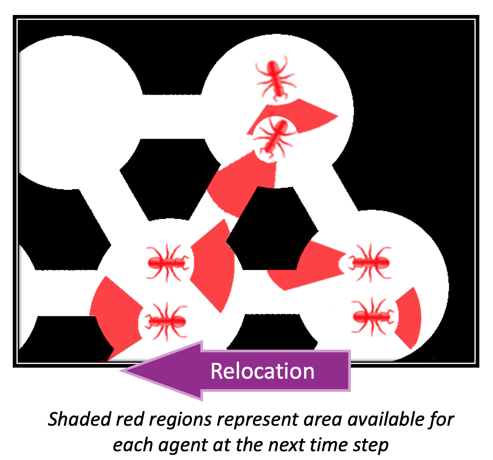

# V.Andrei-NestRelocation
Simulation source code and data files for the harvester ants nest relocation paper ***(DOI link)***

TL;DR: [here](Poster.pdf) is a poster about our research and the simulation and [here](presentation.pptx) are some slides

## What are we doing here?
This is an agent-based simulation of the experiment where *Veromessor Andrei* ants are moving between artifical ant nests. One of the nests is heated up, which creates the incentive for the ants (agents) to move out of it and occupy the second (cooler) nest.

Even though there is incentive for the ants to evetually relocate to the cooler structure, we assume independent and stochastic decision making meachanism for individual ants at every time step. The heat influence is incorporated as a factor that makes agents' random movements more biased towards one of the directions. Below is a schematic of the step generation process

And here is an intuitive visual represnetation of how the bias works:

## Structure of the code

